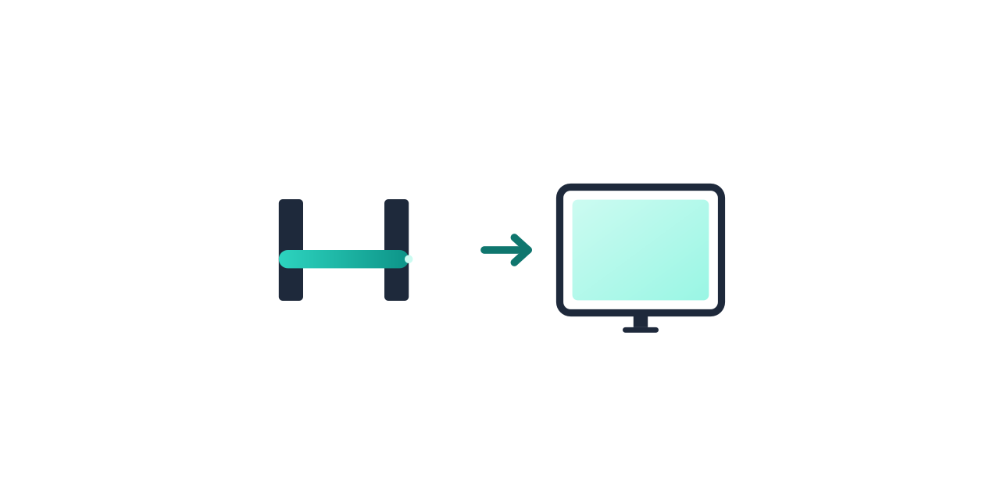

# node-hp-scan-to


[](https://sonarcloud.io/summary/new_code?id=node-hp-scan-to)
[](https://sonarcloud.io/summary/new_code?id=node-hp-scan-to)

[](https://www.npmjs.com/package/node-hp-scan-to)
[](https://hub.docker.com/repository/docker/manuc66/node-hp-scan-to)
[](https://www.codefactor.io/repository/github/manuc66/node-hp-scan-to)
[](https://app.fossa.com/projects/git%2Bgithub.com%2Fmanuc66%2Fnode-hp-scan-to?ref=badge_shield)

<p align="center">
  
</p>

**`node-hp-scan-to`** is a Node.js application that replicates HP's "_Scan to Computer_" functionality by [reverse engineering HP's proprietary protocols](protocol_doc/HP%20Officejet%206500%20E710n-z.md) and supporting the standardized [eSCL protocol](protocol_doc/HP%20PageWide%20Pro%20477dw%20MFP.md), allowing you to scan documents directly from your HP printer's scanner to your Linux, Windows, or macOS computer.

Unlike the original HP program, `node-hp-scan-to` is cross-platform and can be run on a bare-metal desktop or server, or in a container on Docker or Kubernetes. It can also be integrated with third-party document management solutions such as [Paperless-ngx](https://docs.paperless-ngx.com/) and [Nextcloud](https://Nextcloud.com/).

**Disclaimer:** _This project is neither endorsed by nor affiliated with Hewlett-Packard (HP). Any mention or reference to HP is purely descriptive and non-commercial. All reverse engineering of HP's official Windows application and its interaction with devices has been performed independently without cooperation from HP. **This software is provided as-is for educational and personal use only**._

<!-- TOC -->

- [Features](#features)
  - [Supported Devices](#supported-devices)
  - [Supported Functions](#supported-functions)
  - [App Features](#app-features)
  - [Protocol Support](#protocol-support)
  - [Emulated Duplex Scanning Feature](#emulated-duplex-scanning-feature)
- [Installation](#installation)
  - [Using NodeJS](#using-nodejs)
  - [Using Docker](#using-docker)
- [Usage](#usage)
  - [Command Line (CLI)](#command-line-cli)
    - [CLI Options](#cli-options)
    - [CLI Commands](#cli-commands)
  - [Run with Docker](#run-with-docker)
    - [Public Pre-Built Docker image](#public-pre-built-docker-image)
    - [Docker Environment Variables](#docker-environment-variables)
    - [Example for Docker](#example-for-docker)
    - [Example for Docker Compose](#example-for-docker-compose)
  - [Run with Kubernetes](#run-with-kubernetes)
  - [Configure](#Configure)
- [Build Source Code](#build-source-code)
  - [Debugging](#debugging)
- [Reverse Engineering](#reverse-engineering)
- [💖 Support this project](#-support-this-project)
- [🙏 Special Thanks](#-special-thanks)
- [License](#license)

<!-- /TOC -->

## Features

### Supported Devices

This app has been developed and tested with the following HP All-in-One Printers:

- HP DeskJet 3520
- HP OfficeJet 6500A Plus
- HP Smart Tank Plus 570 series
- HP OfficeJet Pro 9019e

Users have reported it also working on additional devices. See
[SUPPORTED_DEVICES.md](SUPPORTED_DEVICES.md) for the full community-reported list
and the process for adding a new printer report.

There is a good chance it also works on other unlisted HP All-in-One Printer.

### Supported Functions

- ✔️ JPG and PDF document scan output
- ✔️ Automatic document feeder (ADF) support with dual-side scanning
- ✔️ Multi-page platen scanning
- ✔️ Automatic IP address discovery

### App Features

- ✔️ Multi-platform: Linux, Windows, and macOS
- ✔️ Prebuilt Docker images (multi-architecture)
- ✔️ Command line (CLI) support
- ✔️ Customizable file names, resolutions, and device labels
- ✔️ Clear all registered targets
- ✔️ Emulated double side scan
- ✔️ Multiple output target support:
  - Local folders
  - [Paperless-ngx API](https://docs.paperless-ngx.com/api/) upload
  - [Nextcloud WebDAV](https://docs.Nextcloud.com/server/latest/user_manual/en/files/access_webdav.html) upload

### Protocol Support

Supports both HP proprietary protocols (WalkupScanToComp, WalkupScan, ScanJob) and the standardized eSCL protocol.

- **eSCL-only devices** (e.g., HP ScanJet Pro 4500 fn1): Automatically detected and supported ([#1307](https://github.com/manuc66/node-hp-scan-to/issues/1307))
- **Dual-protocol devices**: Uses HP protocols by default; add `--prefer-eSCL` flag to use eSCL instead
- See [eSCL protocol documentation](protocol_doc/HP%20PageWide%20Pro%20477dw%20MFP.md) for technical details

### Emulated Duplex Scanning Feature

The emulated duplex scanning feature allows users to efficiently scan both sides of a document, even on devices that do
not natively support duplex scanning. However, please note that this feature is only available in listen mode and is not supported with ADF-autoscan.

When enabled (as an opt-in feature), it adds an extra entry in the list of scan destinations, labeled with the "duplex"
suffix. When you select this option for the first time, the device scans the front side of the document.

After the front side is scanned, if you choose the duplex option again, the device will trigger a second scan and
produce an assembled output.

If you decide not to scan the back side immediately, the front side scan will be saved in the system and will remain
there until you either scan the back side or perform a single side scan instead.

## Installation

### Using NodeJS

- You must have [NodeJS installed](https://nodejs.org/en/download)

- In a Terminal, run: `npm install node-hp-scan-to`

### Using standalone binaries (Windows, macOS, Linux)

Each [release](https://github.com/manuc66/node-hp-scan-to/releases/latest) ships self-contained executables (no NodeJS required):

| File                                    | Platform                                                           |
| --------------------------------------- | ------------------------------------------------------------------ |
| `setup-node-hp-scan-to-v*.exe`          | Windows 10/11 x64 installer (per-user autostart or system service) |
| `node-hp-scan-to-v*-windows-x64.zip`    | Windows 10/11 x64 portable                                         |
| `node-hp-scan-to-v*-darwin-arm64.zip`   | Apple Silicon                                                      |
| `node-hp-scan-to-v*-darwin-x64.zip`     | Intel Mac                                                          |
| `node-hp-scan-to-v*-linux-x64.tar.gz`   | Linux x64                                                          |
| `node-hp-scan-to-v*-linux-arm64.tar.gz` | Linux ARM64                                                        |

Extract the archive anywhere and run `node-hp-scan-to` from its folder. It automatically reads the `config/default.json` shipped next to the binary; edit it to your needs.

The Windows installer offers two modes:

- _For me_ (default, no admin rights): installs to `%LOCALAPPDATA%\Programs\node-hp-scan-to`, saves scans to the `hp-scan` folder inside your Documents (follows OneDrive redirection) and starts hidden at login via a scheduled task, with a persistent log in `%APPDATA%\node-hp-scan-to\logs\scan.log`
- _Windows service for all users_: installs to `Program Files`, runs as a service via [WinSW](https://github.com/winsw/winsw) and saves scans to `C:\ProgramData\node-hp-scan-to\scans`

Both modes also let you pick the startup behaviour: waiting for scan jobs triggered from the printer panel, or scanning automatically each time paper is loaded into the document feeder (`adf-autoscan`).

Notes:

- **Windows**: SmartScreen may warn about an unsigned executable — click _More info_ → _Run anyway_
- **macOS**: the binary is unsigned, so Gatekeeper may block it on first run. Either right-click → _Open_, or clear the quarantine flag with `xattr -cr node-hp-scan-to`

### Using Debian / RPM packages

`.deb` and `.rpm` packages (`amd64`/`arm64`) are attached to each [release](https://github.com/manuc66/node-hp-scan-to/releases/latest). They install `/usr/bin/node-hp-scan-to`, a `node-hp-scan-to.service` systemd unit (enabled with `systemctl enable --now node-hp-scan-to`) and an example configuration in `/etc/node-hp-scan-to/default.json`:

```bash
sudo apt install ./node-hp-scan-to_*_amd64.deb
# or
sudo rpm -i node-hp-scan-to-*.x86_64.rpm
```

Scans are saved under `/var/lib/node-hp-scan-to` by default when running as a service.

Linux networking notes:

- the service only makes **outbound** connections: mDNS discovery (UDP 5353 multicast), plain HTTP calls to the printer itself on port 80 (discovery tree, scan job creation and polling), and HTTPS uploads to Paperless-ngx/Nextcloud when configured — nothing listens for the scanning flow itself
- `--health-check` listens on **all interfaces** (port 3000 by default); restrict it with a local firewall rule if that matters to you, or drop the flag from `/usr/lib/systemd/system/node-hp-scan-to.service`
- the packaged systemd unit runs under a dynamic non-root user with `PrivateTmp`, read-only system paths and an empty capability set

#### Alpine Linux

`.apk` packages (`x86_64`/`aarch64`) are attached to each [release](https://github.com/manuc66/node-hp-scan-to/releases/latest). They ship a **musl** build, install the binary, an OpenRC service and `/etc/node-hp-scan-to/default.json`, and create a `node-scan` system user (scans land in `/var/lib/node-hp-scan-to`):

```sh
apk add ./node-hp-scan-to_*_x86_64.apk
rc-update add node-hp-scan-to default
rc-service node-hp-scan-to start
```

#### Saving scans in your own user folder

The system service is sandboxed on purpose, so point it at your home folder this way:

1. set `"directory"` in `/etc/node-hp-scan-to/default.json` to your folder
2. allow writes through the sandbox and to the dynamic user:

```bash
sudo systemctl edit node-hp-scan-to
# add:
#   [Service]
#   ReadWritePaths=/home/YOU/Documents/scans
#   SupplementaryGroups=users
# then: sudo chmod g+w /home/YOU/Documents/scans
```

Simpler alternative — run the app **as yourself** with the shipped per-user unit:

```bash
mkdir -p ~/.config/node-hp-scan-to
cp /etc/node-hp-scan-to/default.json ~/.config/node-hp-scan-to/
systemctl --user enable --now node-hp-scan-to
# optional: also start at boot without being logged in
sudo loginctl enable-linger "$USER"
```

#### Verifying release artifacts

Every release artifact ships with a Sigstore build provenance attestation bound to the exact commit and workflow that produced it, plus a dependency SBOM (CycloneDX), and a checksum file:

```bash
gh attestation verify node-hp-scan-to_*_amd64.deb -R manuc66/node-hp-scan-to
gh attestation verify release/node-hp-scan-to.sbom.json -R manuc66/node-hp-scan-to --predicate-type https://cyclonedx.org/bom
sha256sum -c SHA256SUMS.txt
```

### Using Docker

- You must have [Docker installed](https://www.docker.com/get-started/)

- In a Terminal, run: `docker run -d -e IP="IP_ADDRESS_OF_PRINTER" -e PGID=1000 -e PUID=1000 docker.io/manuc66/node-hp-scan-to`

- For more Docker options, see the [Run with Docker](#run-with-docker) section

- For running with Docker Compose, see the [Example for Docker Compose](#example-for-docker-compose) section

### Using Arch Linux (AUR)

- The package is available in the Arch User Repository (AUR) as `node-hp-scan-to`

- Install it using your preferred AUR helper, for example:
  ```bash
  yay -S node-hp-scan-to
  ```
  or
  ```bash
  paru -S node-hp-scan-to
  ```

## Usage

### Command Line (CLI)

Running the app with NodeJS using the `npx` command:

`npx node-hp-scan-to`

Main options:

- `-a, --address <ip>`: Printer IP (e.g., `192.168.0.5`)
- `-d, --directory <path>`: Save scans to (e.g., `~/scans`)

Example usage:

`npx node-hp-scan-to -a 192.168.0.5 -d ~/scans`

#### Discovering devices

`npx node-hp-scan-to discover`

Lists every HP scan-capable device found on the network, one `name<TAB>ip` pair per line. Devices are discovered through mDNS and verified against the printer's proprietary `DiscoveryTree.xml` endpoint, so other network gadgets are filtered out. Useful to pick the right `-n/--name` value (recommended over a fixed IP, since it keeps working when the printer's DHCP lease changes).

Options: `--timeout <seconds>` (browsing window, default 5), `--json` (machine-readable array), `--ip <address[:port]>` (verify a single address), `--name <prefix>` (only keep matching names). Exit code is `0` when at least one device was found.

#### CLI Options

Run `npx node-hp-scan-to --help` to see the full list of options below:

| Option                                | Description                                                                                                                                                                                                                    | Example/Default                                                   |
| ------------------------------------- | ------------------------------------------------------------------------------------------------------------------------------------------------------------------------------------------------------------------------------ | ----------------------------------------------------------------- |
| `-a`, `--address`                     | Printer IP address.                                                                                                                                                                                                            | `-a 192.168.0.5` (no default)                                     |
| `-d`, `--directory`                   | Directory to save scanned documents. Defaults to `/tmp/scan-to-pc<random value>` if not set.                                                                                                                                   | `-d /tmp/scan-to-pc1234`                                          |
| `-D`, `--debug`                       | Enable debug logging.                                                                                                                                                                                                          | `-D` (disabled by default)                                        |
| `-f`, `--image-format`                | Image format for scans (when not PDF).                                                                                                                                                                                         | `-f Jpeg` (choices: Jpeg, Bmp)                                    |
| `-h`, `--height`                      | Scan height in pixels. Defaults to 3507.                                                                                                                                                                                       | `-h 3507`                                                         |
| `-k`, `--keep-files`                  | Retain scanned files after uploading to Paperless-ngx or Nextcloud (disabled by default).                                                                                                                                      | `-k` (disabled by default)                                        |
| `-l`, `--label`                       | The name of the computer running this app. Defaults to the hostname.                                                                                                                                                           | `-l <hostname>` (default: system hostname)                        |
| `-n`, `--name`                        | Printer name (quote if it contains spaces).                                                                                                                                                                                    | `-n "Officejet 6500 E710n-z"` (no default)                        |
| `-o`, `--paperless-token`             | The paperless token. Required unless `----paperless-token-file` is used. Overrides if both are provided.                                                                                                                       | `-o xxxxxxxxxxxx` (no default)                                    |
| `--paperless-token-file`              | File name that contains the paperless token. Required unless `---paperless-token` is used. Takes precedence if both are provided.                                                                                              | `--paperless-token-file some/path/to/file` (no default)           |
| `-p`, `--pattern`                     | Filename pattern (no extension). Use quotes for static text, supports date/time masks (see [dateformat docs](https://www.npmjs.com/package/dateformat#mask-options)). Defaults to `scan<increasing number>_page<page number>`. | `-p scan1_page1`                                                  |
| `-r`, `--resolution`                  | Scan resolution in DPI. Defaults to 200.                                                                                                                                                                                       | `-r 200`                                                          |
| `--mode <mode> `                      | Selects the scan mode (default: Color) (choices: "Gray", "Color").                                                                                                                                                             | `--mode Gray`                                                     |
| `--paper-size <size>`                 | Paper size preset: A4 (default), Letter, Legal, A5, B5, or Max (case-insensitive). Cannot be used with `--paper-dim`.                                                                                                          | `--paper-size Letter`                                             |
| `--paper-orientation <orientation>`   | Paper orientation: portrait (default) or landscape. Applied to `--paper-size` only.                                                                                                                                            | `--paper-orientation landscape`                                   |
| `--paper-dim <dimensions>`            | Custom paper dimensions with unit (e.g., 21x29.7cm, 8.5x11in, 210x297mm). Cannot be used with `--paper-size`.                                                                                                                  | `--paper-dim 8.5x11in`                                            |
| `-s`, `--paperless-post-document-url` | Paperless-ngx API URL for uploading documents.                                                                                                                                                                                 | `-s https://domain.tld/api/documents/post_document/` (no default) |
| `-t`, `--temp-directory`              | Temporary directory for processing. Defaults to `/tmp/scan-to-pc<random value>` if not set.                                                                                                                                    | `-t /tmp/scan-to-pc5678`                                          |
| `-w`, `--width`                       | Scan width in pixels. Defaults to 2481.                                                                                                                                                                                        | `-w 2481`                                                         |
| `--device-up-polling-interval`        | Polling interval (in milliseconds) to check if the printer is online.                                                                                                                                                          | `--device-up-polling-interval 5000` (no default)                  |
| `--nextcloud-password`                | Nextcloud app password. Required unless `--nextcloud-password-file` is used. Overrides if both are provided.                                                                                                                   | `--nextcloud-password mypassword` (no default)                    |
| `--nextcloud-password-file`           | File containing the Nextcloud app password. Required unless `--nextcloud-password` is used. Takes precedence if both are provided.                                                                                             | `--nextcloud-password-file /path/to/file` (no default)            |
| `--nextcloud-upload-folder`           | Nextcloud folder for uploads. Defaults to `scan`.                                                                                                                                                                              | `--nextcloud-upload-folder scan`                                  |
| `--nextcloud-url`                     | Nextcloud instance URL.                                                                                                                                                                                                        | `--nextcloud-url https://domain.tld` (no default)                 |
| `--nextcloud-username`                | Nextcloud username with write access to the upload folder.                                                                                                                                                                     | `--nextcloud-username user` (no default)                          |

**Notes:**

- Date/time patterns for `--pattern` follow the [dateformat](https://www.npmjs.com/package/dateformat) library's "Mask options" section.

- Defaults like `/tmp/scan-to-pc<random value>` include a random suffix in practice (e.g., `/tmp/scan-to-pc1234`).

#### Paper Size Configuration

By default, scans use **A4 paper size** (210×297 mm). You can specify a different paper size or custom dimensions via CLI flags, environment variables, or the config file.

##### Preset Paper Sizes

The following preset sizes are available (case-insensitive):

| Preset           | Dimensions     | Use Case                                                   |
| ---------------- | -------------- | ---------------------------------------------------------- |
| **A4** (default) | 210×297 mm     | Standard European paper size                               |
| **Letter**       | 215.9×279.4 mm | Standard US letter size                                    |
| **Legal**        | 215.9×355.6 mm | Standard US legal size                                     |
| **A5**           | 148×210 mm     | Half of A4 size                                            |
| **B5**           | 176×250 mm     | Between A4 and A5                                          |
| **Max**          | Device maximum | Uses the device's maximum scannable area (not auto-detect) |

##### Custom Sizes

You can specify custom paper dimensions with explicit units using the `--paper-dim` option:

```bash
# Centimeters
npx node-hp-scan-to single-scan --paper-dim 21x29.7cm

# Inches
npx node-hp-scan-to single-scan --paper-dim 8.5x11in

# Millimeters
npx node-hp-scan-to single-scan --paper-dim 210x297mm
```

**Supported units:** `cm`, `mm`, `in` (inches). Units are **required** and **case-insensitive**.

##### Configuration Precedence

Paper size is resolved in the following order (highest to lowest priority):

1. **CLI flags**: `--paper-size` or `--paper-dim`
2. **Environment variables**: `PAPER_SIZE` or `PAPER_DIM`
3. **Config file**: `paper_size` or `paper_dim` in `config/default.json`
4. **Default**: A4 (210×297 mm)

##### Important Rules

- **Cannot specify both `--paper-size` and `--paper-dim` simultaneously.** You must choose one; attempting to use both will result in an error.
- **Resolution (DPI) is independent** of paper size. You can specify both independently:
  ```bash
  npx node-hp-scan-to single-scan --paper-size Letter --resolution 300
  ```
- **Device maximum is respected.** If your custom size exceeds the device's maximum scannable area, the scan will be clamped to the device's limits.
- **"Max" uses device capabilities, not auto-detection.** The `Max` preset uses the device's reported maximum scan area; it does **not** automatically detect the actual paper size in the scanner.

##### Examples

```bash
# Use Letter size
npx node-hp-scan-to single-scan --paper-size Letter

# Use A5 (smaller) size
npx node-hp-scan-to single-scan --paper-size A5

# Use maximum scannable area
npx node-hp-scan-to single-scan --paper-size Max

# Use custom size in centimeters
npx node-hp-scan-to single-scan --paper-dim 21x29.7cm

# Use custom size in inches (8.5" × 11")
npx node-hp-scan-to single-scan --paper-dim 8.5x11in

# With Docker (environment variable)
docker run -e PAPER_SIZE=Letter manuc66/node-hp-scan-to

# With Docker Compose
environment:
  PAPER_SIZE: "Letter"
  PAPER_DIM: null  # Must be null if not using custom dimensions

# In config file (config/default.json)
{
  "paper_size": "A4",
  "paper_dim": null
}
```

#### Post-Processing Command

Every generated scan file can be handed to an external command **before it is uploaded or cleaned up**. It runs on:

- the generated PDFs (from the `--pdf` output mode, or the Paperless `--paperless-always-send-as-pdf-file` / `--paperless-group-multi-page-scan-into-a-pdf` flows);
- the delivered images (beyond a Paperless PDF-conversion flow), i.e. each scan page kept on disk or uploaded as an image.

Typical uses:

| Output | Examples |
|---|---|
| **PDF** | PDF/A archiving (Ghostscript), digital signature, stamping, metadata injection, OCR text layer |
| **Image (Jpeg/Bmp)** | recompression/resizing, watermarking, EXIF metadata injection, format conversion |

Set it with `--post-command <template>` or `post_command` in the config file:

```sh
# PDF/A conversion with Ghostscript
node-hp-scan-to --address <printer> single-scan --pdf \
  --post-command 'gswin64c -dPDFA=2 -sDEVICE=pdfwrite "{input}" -o "{output}"'

# Add EXIF metadata to a Jpeg scan (exiftool can update the file in place)
node-hp-scan-to --address <printer> single-scan \
  --post-command 'exiftool -overwrite_original -XResolution=200 "{input}"'
```

The template supports two placeholders:

- `{input}`: the absolute path of the generated file.
- `{output}`: an absolute temporary file path. When the template contains `{output}`, the resulting file **atomically replaces the original file** if the command succeeds. A command that cannot overwrite its input in place (Ghostscript is one) should therefore write to `{output}`.

When the template does not use `{output}`, the command is expected to modify the file in place.

Since the command runs on every delivered file, make sure it handles the file type it receives (PDF or image). For instance a PDF/A template would not be appropriate for image output.

Failure policy: if the command exits with a non-zero code, or no `{output}` file is produced, the original file is kept and an error is logged — the scan flow continues as if the command had not been configured.

> ⚠️ **Security**: the template is executed by the local shell (`cmd.exe` on Windows, `/bin/sh` elsewhere). Only pass values you control; never build it from untrusted input.

##### `listen`

By default, this app runs the `listen` command as the default mode. It will listen to the print for new job and trigger based on the selection on the device.

Run `npx node-hp-scan-to listen --help` to get the full list of command options.

<!-- BEGIN HELP command: listen -->

```text
Usage:  listen [options]

Listen the device for new scan job to save to this target

Output Options:
  -d, --directory <dir>                                            Directory where scans are saved (default: /tmp/scan-to-pcRANDOM)
  -p, --pattern <pattern>                                          Pattern for filename (i.e. "scan"_dd.mm.yyyy_HHMMss, default would be scanPageNUMBER), make sure that the pattern is enclosed in extra quotes, avoid ":" as it is invalid on windows
  -f, --image-format <format>                                      Image format for scans (when not PDF): Jpeg (default) or Bmp
  -k, --keep-files                                                 Keep the scan files on the file system when sent to external systems for local backup and easy access (default: false)
  --post-command <template>                                        Command template run on every generated file ({input} is the file path; when the template contains {output} the command output file replaces it, e.g. a Ghostscript PDF/A conversion).

Scan Options:
  -r, --resolution <dpi>                                           Resolution in DPI of the scans (default: 200)
  --mode <mode>                                                    Selects the scan mode (default: Color) (choices: "Gray", "Color")
  -w, --width <width>                                              Width in pixels of the scans (default: max)
  -h, --height <height>                                            Height in pixels of the scans (default: max)
  --paper-size <size>                                              Paper size preset: A4 (default), Letter, Legal, A5, B5, or Max (case-insensitive)
  --paper-orientation <orientation>                                Paper orientation: portrait (default) or landscape. Applied to --paper-size only. (choices: "portrait", "landscape")
  --paper-dim <dimensions>                                         Custom paper dimensions with unit (e.g., 21x29.7cm, 8.5x11in, 210x297mm). Cannot be used with --paper-size.
  -t, --temp-directory <dir>                                       Temp directory used for processing (default: /tmp/scan-to-pcRANDOM)
  --prefer-eSCL                                                    Prefer eSCL protocol if available

Options:
  --device-up-polling-interval <deviceUpPollingInterval>           Device up polling interval in milliseconds
  --help                                                           display help for command

Paperless Options:
  -s, --paperless-post-document-url <paperless_post_document_url>  The paperless post document url (example: https://domain.tld/api/documents/post_document/)
  -o, --paperless-token <paperless_token>                          The paperless token. Either this or paperless-token-file is required for paperless integration.
  --paperless-token-file <paperless_token_file>                    File name that contains the paperless token. Either this or paperless-token is required for paperless integration.
  --paperless-group-multi-page-scan-into-a-pdf                     Combine multiple scanned images into a single PDF document
  --paperless-always-send-as-pdf-file                              Always convert scan job to pdf before sending to paperless

Nextcloud Options:
  --nextcloud-url <nextcloud_url>                                  The nextcloud url (example: https://domain.tld)
  --nextcloud-username <nextcloud_username>                        The nextcloud username
  --nextcloud-password <nextcloud_app_password>                    The nextcloud app password for username. Either this or nextcloud-password-file is required for nextcloud integration.
  --nextcloud-password-file <nextcloud_app_password_file>          File name that contains the nextcloud app password for username. Either this or nextcloud-password is required for nextcloud integration.
  --nextcloud-upload-folder <nextcloud_upload_folder>              The upload folder where documents or images are uploaded (default: scan)

Device Control Screen Options:
  -l, --label <label>                                              The label to display on the device (the default is the hostname)
  --add-emulated-duplex [mode]                                     Enable emulated duplex scanning, with optional assembly mode (default: document-wise) (choices: "page-wise", "document-wise", "reverse-front", "reverse-both")
  --emulated-duplex-label <label>                                  The emulated duplex label to display on the device (the default is to suffix the main label with duplex)

Global Options:
  -a, --address <ip>                                               IP address of the device, when specified, the ip will be used instead of the name
  -n, --name <name>                                                Name of the device to lookup for on the network
  -D, --debug                                                      Enable debug
  --health-check                                                   Start an http health check endpoint
  --health-check-port <health-check-port>                          Define the port for the HTTP health check endpoint
```

<!-- END HELP command: listen -->

##### `adf-autoscan`

Running `npx node-hp-scan-to adf-autoscan` will automatically trigger a scan job as soon as the ADF (automatic document feeder) on the printer's scanner is loaded with paper.

You can also set the environment variable `MAIN_COMMAND="adf-autoscan"` with Docker. Example:

```sh
docker run -e MAIN_COMMAND="adf-autoscan" -e CMDLINE=--debug docker.io/manuc66/node-hp-scan-to:latest
```

###### Logging

Logs go to stdout. The default output is **backward compatible** with the
previous plain-text messages (one message per line), so existing scripts that
parse stdout keep working unchanged. In an interactive terminal they are
formatted for humans instead.

Structured JSON lines are available **opt-in** via `LOG_FORMAT=json` — the
recommended choice for docker log drivers and aggregators such as Loki or ELK.

| Env var      | Values                            | Effect                                                                                                                                                                                                                                                   |
| ------------ | --------------------------------- | -------------------------------------------------------------------------------------------------------------------------------------------------------------------------------------------------------------------------------------------------------- |
| `LOG_LEVEL`  | `trace` … `fatal`                 | Minimum level to emit (default `info`). `debug` shows HTTP traces too.                                                                                                                                                                                   |
| `LOG_FORMAT` | `auto`, `pretty`, `plain`, `json` | `auto` (default): pretty in a terminal, legacy plain message text otherwise. `pretty` forces time/level/module output anywhere (no ANSI in non-TTY). `plain` forces the legacy message-only text anywhere. `json` forces structured JSON lines anywhere. |

Sensitive fields (`password`, `token`, `authToken`, `Authorization`) are
redacted as `[Redacted]` in every log line.

Run `npx node-hp-scan-to adf-autoscan --help` to get command line usage help.

<!-- BEGIN HELP command: adf-autoscan -->

```text
Usage:  adf-autoscan [options]

Automatically trigger a new scan job to this target once paper is detected in
the automatic document feeder (adf)

Output Options:
  -d, --directory <dir>                                            Directory where scans are saved (default: /tmp/scan-to-pcRANDOM)
  -p, --pattern <pattern>                                          Pattern for filename (i.e. "scan"_dd.mm.yyyy_HHMMss, default would be scanPageNUMBER), make sure that the pattern is enclosed in extra quotes, avoid ":" as it is invalid on windows
  -f, --image-format <format>                                      Image format for scans (when not PDF): Jpeg (default) or Bmp
  -k, --keep-files                                                 Keep the scan files on the file system when sent to external systems for local backup and easy access (default: false)
  --post-command <template>                                        Command template run on every generated file ({input} is the file path; when the template contains {output} the command output file replaces it, e.g. a Ghostscript PDF/A conversion).
  --pdf                                                            If specified, the scan result will always be a pdf document, the default depends on the device choice

Scan Options:
  -r, --resolution <dpi>                                           Resolution in DPI of the scans (default: 200)
  --mode <mode>                                                    Selects the scan mode (default: Color) (choices: "Gray", "Color")
  -w, --width <width>                                              Width in pixels of the scans (default: max)
  -h, --height <height>                                            Height in pixels of the scans (default: max)
  --paper-size <size>                                              Paper size preset: A4 (default), Letter, Legal, A5, B5, or Max (case-insensitive)
  --paper-orientation <orientation>                                Paper orientation: portrait (default) or landscape. Applied to --paper-size only. (choices: "portrait", "landscape")
  --paper-dim <dimensions>                                         Custom paper dimensions with unit (e.g., 21x29.7cm, 8.5x11in, 210x297mm). Cannot be used with --paper-size.
  -t, --temp-directory <dir>                                       Temp directory used for processing (default: /tmp/scan-to-pcRANDOM)
  --prefer-eSCL                                                    Prefer eSCL protocol if available
  --duplex                                                         If specified, all the scans will be in duplex if the device support it

Options:
  --device-up-polling-interval <deviceUpPollingInterval>           Device up polling interval in milliseconds
  --help                                                           display help for command

Paperless Options:
  -s, --paperless-post-document-url <paperless_post_document_url>  The paperless post document url (example: https://domain.tld/api/documents/post_document/)
  -o, --paperless-token <paperless_token>                          The paperless token. Either this or paperless-token-file is required for paperless integration.
  --paperless-token-file <paperless_token_file>                    File name that contains the paperless token. Either this or paperless-token is required for paperless integration.
  --paperless-group-multi-page-scan-into-a-pdf                     Combine multiple scanned images into a single PDF document
  --paperless-always-send-as-pdf-file                              Always convert scan job to pdf before sending to paperless

Nextcloud Options:
  --nextcloud-url <nextcloud_url>                                  The nextcloud url (example: https://domain.tld)
  --nextcloud-username <nextcloud_username>                        The nextcloud username
  --nextcloud-password <nextcloud_app_password>                    The nextcloud app password for username. Either this or nextcloud-password-file is required for nextcloud integration.
  --nextcloud-password-file <nextcloud_app_password_file>          File name that contains the nextcloud app password for username. Either this or nextcloud-password is required for nextcloud integration.
  --nextcloud-upload-folder <nextcloud_upload_folder>              The upload folder where documents or images are uploaded (default: scan)

Auto-scan Options:
  --pollingInterval <pollingInterval>                              Time interval in millisecond between each lookup for content in the automatic document feeder
  --start-scan-delay <startScanDelay>                              Once document are detected to be in the adf, this specify the wait delay in millisecond before triggering the scan

Global Options:
  -a, --address <ip>                                               IP address of the device, when specified, the ip will be used instead of the name
  -n, --name <name>                                                Name of the device to lookup for on the network
  -D, --debug                                                      Enable debug
  --health-check                                                   Start an http health check endpoint
  --health-check-port <health-check-port>                          Define the port for the HTTP health check endpoint
```

<!-- END HELP command: adf-autoscan -->

##### `clear-registrations`

Running `npx node-hp-scan-to clear-registratons` will clear all registered targets on the device (useful for trial and error and debugging).

Run `npx node-hp-scan-to clear-registrations --help` to get command line usage help.

You can also set the environment variable `MAIN_COMMAND="clear-registrations"` with Docker. Example:

```sh
docker run -e MAIN_COMMAND="clear-registrations" docker.io/manuc66/node-hp-scan-to:latest
```

<!-- BEGIN HELP command: clear-registrations -->

```text
Usage:  clear-registrations [options]

Clear the list or registered target on the device

Options:
  -h, --help                               display help for command

Global Options:
  -a, --address <ip>                       IP address of the device, when specified, the ip will be used instead of the name
  -n, --name <name>                        Name of the device to lookup for on the network
  -D, --debug                              Enable debug
  --health-check                           Start an http health check endpoint
  --health-check-port <health-check-port>  Define the port for the HTTP health check endpoint
```

<!-- END HELP command: clear-registrations -->

##### `single-scan`

Running `npx node-hp-scan-to single-scan` will directly issue a single scan job

Run `npx node-hp-scan-to single-scan --help` to get command line usage help.

You can also set the environment variable `MAIN_COMMAND="single-scan"` with Docker. Example:

```sh
docker run -e MAIN_COMMAND="single-scan" docker.io/manuc66/node-hp-scan-to:latest
```

<!-- BEGIN HELP command: single-scan -->

```text
Usage:  single-scan [options]

Trigger a new scan job

Output Options:
  -d, --directory <dir>                                            Directory where scans are saved (default: /tmp/scan-to-pcRANDOM)
  -p, --pattern <pattern>                                          Pattern for filename (i.e. "scan"_dd.mm.yyyy_HHMMss, default would be scanPageNUMBER), make sure that the pattern is enclosed in extra quotes, avoid ":" as it is invalid on windows
  -f, --image-format <format>                                      Image format for scans (when not PDF): Jpeg (default) or Bmp
  -k, --keep-files                                                 Keep the scan files on the file system when sent to external systems for local backup and easy access (default: false)
  --post-command <template>                                        Command template run on every generated file ({input} is the file path; when the template contains {output} the command output file replaces it, e.g. a Ghostscript PDF/A conversion).
  --pdf                                                            If specified, the scan result will always be a pdf document, the default depends on the device choice

Scan Options:
  -r, --resolution <dpi>                                           Resolution in DPI of the scans (default: 200)
  --mode <mode>                                                    Selects the scan mode (default: Color) (choices: "Gray", "Color")
  -w, --width <width>                                              Width in pixels of the scans (default: max)
  -h, --height <height>                                            Height in pixels of the scans (default: max)
  --paper-size <size>                                              Paper size preset: A4 (default), Letter, Legal, A5, B5, or Max (case-insensitive)
  --paper-orientation <orientation>                                Paper orientation: portrait (default) or landscape. Applied to --paper-size only. (choices: "portrait", "landscape")
  --paper-dim <dimensions>                                         Custom paper dimensions with unit (e.g., 21x29.7cm, 8.5x11in, 210x297mm). Cannot be used with --paper-size.
  -t, --temp-directory <dir>                                       Temp directory used for processing (default: /tmp/scan-to-pcRANDOM)
  --prefer-eSCL                                                    Prefer eSCL protocol if available
  --duplex                                                         If specified, all the scans will be in duplex if the device support it

Options:
  --device-up-polling-interval <deviceUpPollingInterval>           Device up polling interval in milliseconds
  --help                                                           display help for command

Paperless Options:
  -s, --paperless-post-document-url <paperless_post_document_url>  The paperless post document url (example: https://domain.tld/api/documents/post_document/)
  -o, --paperless-token <paperless_token>                          The paperless token. Either this or paperless-token-file is required for paperless integration.
  --paperless-token-file <paperless_token_file>                    File name that contains the paperless token. Either this or paperless-token is required for paperless integration.
  --paperless-group-multi-page-scan-into-a-pdf                     Combine multiple scanned images into a single PDF document
  --paperless-always-send-as-pdf-file                              Always convert scan job to pdf before sending to paperless

Nextcloud Options:
  --nextcloud-url <nextcloud_url>                                  The nextcloud url (example: https://domain.tld)
  --nextcloud-username <nextcloud_username>                        The nextcloud username
  --nextcloud-password <nextcloud_app_password>                    The nextcloud app password for username. Either this or nextcloud-password-file is required for nextcloud integration.
  --nextcloud-password-file <nextcloud_app_password_file>          File name that contains the nextcloud app password for username. Either this or nextcloud-password is required for nextcloud integration.
  --nextcloud-upload-folder <nextcloud_upload_folder>              The upload folder where documents or images are uploaded (default: scan)

Global Options:
  -a, --address <ip>                                               IP address of the device, when specified, the ip will be used instead of the name
  -n, --name <name>                                                Name of the device to lookup for on the network
  -D, --debug                                                      Enable debug
  --health-check                                                   Start an http health check endpoint
  --health-check-port <health-check-port>                          Define the port for the HTTP health check endpoint
```

<!-- END HELP command: single-scan -->

### Run with Docker

#### Public Pre-Built Docker image

<https://hub.docker.com/repository/docker/manuc66/node-hp-scan-to>

The Docker images follow semantic versioning:

- `latest`: Latest stable release (includes all patch updates)
- `x.y.z`: Specific version (e.g., `1.2.3`)
- `x.y`: Latest patch version of a specific minor version (e.g., `1.2`)
- `x`: Latest minor.patch version of a specific major version (e.g., `1`)
- `master`: Latest build from the master branch (development version)

Note: For most users, the `latest` tag is recommended as it includes all patch updates and bug fixes.

Be aware that with Docker you have to specify the IP address of the printer via the `IP` environment variable, because the Bonjour service discovery protocol uses multicast network traffic, which by default doesn't work in Docker.

You could however use Docker's [macvlan](https://docs.docker.com/engine/network/drivers/macvlan/) networking, this way you can use service discovery and the `NAME` environment variable.

All scanned files are written to the volume `/scan`, the filename can be changed with the `PATTERN` environment variable. For the correct permissions to the volume set the environment variables `PUID` and `PGID` to that of the user running the container (usually `PUID=1000` and `PGID=1000`).

#### Docker Environment Variables

List of supported environment variables and their meaning, or correspondence with [command-line flags](#cli-options):

| Environment Variable          | Description                                                                                                   | Corresponding CLI Flag or Notes                                               |
| ----------------------------- | ------------------------------------------------------------------------------------------------------------- | ----------------------------------------------------------------------------- |
| `CMDLINE`                     | Additional command-line flags added at the end of the command                                                 | Set to `-D` to enable debug logs                                              |
| `DIR`                         | Directory to use                                                                                              | `-d` / `--directory`                                                          |
| `IP`                          | IP address for the program                                                                                    | `-a` / `--address`                                                            |
| `KEEP_FILES`                  | If set, scanned files are not deleted after uploading to Paperless-ngx or Nextcloud                           |                                                                               |
| `LABEL`                       | Label to set on the device's display as a scan target                                                         | `-l` / `--label`                                                              |
| `NAME`                        | Name of the device to lookup for on the network                                                               | `-n` / `--name`                                                               |
| `ADD_EMULATED_DUPLEX`         | Enable emulated duplex scanning, with optional assembly mode (default: document-wise)                         | `--add-emulated-duplex [mode]`                                                |
| `NEXTCLOUD_PASSWORD`          | Password of Nextcloud user (either this or `NEXTCLOUD_PASSWORD_FILE` is required; file takes precedence)      |                                                                               |
| `NEXTCLOUD_PASSWORD_FILE`     | File containing Nextcloud user password (either this or `NEXTCLOUD_PASSWORD` is required; takes precedence)   | Example: `./nextcloud_password.secret` (preferred for Docker Compose secrets) |
| `NEXTCLOUD_UPLOAD_FOLDER`     | Upload folder for documents or images (user must have write permission; defaults to `scan` if not set)        |                                                                               |
| `NEXTCLOUD_URL`               | Nextcloud URL                                                                                                 | Example: `https://nextcloud.example.tld`                                      |
| `NEXTCLOUD_USERNAME`          | Nextcloud username                                                                                            |                                                                               |
| `PAPERLESS_POST_DOCUMENT_URL` | Paperless-ngx post document URL (if provided with token, a PDF is uploaded)                                   | Example: `http://<paperless-host>:<port>/api/documents/post_document/`        |
| `PAPERLESS_TOKEN`             | Paperless-ngx API token (either this or `NEXTCLOUD_PASSWORD_FILE` is required; file takes precedence)         | Example: `xxxxxxxxxxxx...`                                                    |
| `PAPERLESS_TOKEN_FILE`        | File containing paperless-ngx API token (either this or `PAPERLESS_TOKEN_FILE` is required; takes precedence) | Example: `./paperless_token.secret` (preferred for Docker Compose secrets)    |
| `PATTERN`                     | Pattern to use                                                                                                | `-p` / `--pattern`                                                            |
| `PGID`                        | ID of the group that will run the program                                                                     |                                                                               |
| `PUID`                        | ID of the user that will run the program                                                                      |                                                                               |
| `RESOLUTION`                  | Resolution setting                                                                                            | `-r` / `--resolution`                                                         |
| `FORMAT`                      | Image format setting                                                                                          | `-f` / `--image-format`                                                       |
| `MODE`                        | Scan mode setting                                                                                             | `--mode`                                                                      |
| `PAPER_ORIENTATION`           | Paper orientation: portrait (default) or landscape. Applied to `PAPER_SIZE` only.                             | `--paper-orientation`                                                         |
| `TEMP_DIR`                    | Temporary directory                                                                                           | `-t` / `--temp-directory`                                                     |

**Additional Notes:**

- The name shown on the printer’s display is the hostname of the Docker container, which defaults to a random value. You can override it by setting the `hostname` or using the `LABEL` environment variable.

- To enable debug logs set the environment variable `CMDLINE` to `-D`

#### Example for Docker

To build a local Docker image from this repo:

```sh
git clone https://github.com/manuc66/node-hp-scan-to.git
cd node-hp-scan-to
docker build . -t node-hp-scan-to
docker run -e IP=192.168.0.5 -e PGID=1000 -e PUID=1000 --hostname myComputer node-hp-scan-to
```

#### Example for Docker Compose

Create the following `docker-compose.yml` file into this directory:

```yml
services:
  node-hp-scan-to:
    image: docker.io/manuc66/node-hp-scan-to:latest
    restart: unless-stopped
    hostname: node-hp-scan-to
    environment:
      # REQUIRED - Change the next line to the IP address of your HP printer/scanner:
      - IP=192.168.0.5
      # Name that your container will appear as to your printer:
      - LABEL=node-hp-scan-to
      # Set the timezone, such as "Europe/London":
      - TZ=UTC
      # Set the created filename pattern:
      - PATTERN="scan"_dd-mm-yyyy_hh-MM-ss
      # Run the Docker container as the same user ID as the host system:
      - PGID=1000
      - PUID=1000
      # Optional - enable autoscanning a document when loaded into the scanner:
      # - MAIN_COMMAND=adf-autoscan
      # If you need to pass additional configuration flag use the CMDLINE env, thy will be appened to the
      # - CMDLINE=--debug --pdf
      # If using Paperless-ngx, you can use its API to upload files:
      # - PAPERLESS_POST_DOCUMENT_URL=http://<paperless-host>:<port>/api/documents/post_document/
      # - PAPERLESS_TOKEN= xxxxxxxxxxxx...
    volumes:
      - ./scan:/scan
```

Then run `docker-compose up -d`

### Run with Kubernetes

Apply the following manifest (the `PersistentVolumeClaim` must also be deployed beforehand):

```yml
apiVersion: apps/v1
kind: Deployment
name: hp-scan-to
spec:
  replicas: 1
  selector:
    matchLabels:
      app.kubernetes.io/name: hp-scan-to
  template:
    metadata:
      labels:
        app.kubernetes.io/name: hp-scan-to
    spec:
      containers:
        - image: manuc66/node-hp-scan-to:master
          name: hp-scan-to
          env:
            - name: IP
              value: 192.168.0.5
            - name: PATTERN
              value: '"scan"_dd.mm.yyyy_HHMMss'
            - name: PGID
              value: "1000"
            - name: PUID
              value: "1000"
            - name: LABEL
              value: scan
            - name: DIR
              value: /scans
            - name: TZ
              value: Europe/London
          resources:
            limits:
              memory: 256Mi
            requests:
              cpu: "0"
              memory: 64Mi
          volumeMounts:
            - mountPath: /scans
              name: incoming-scans
      restartPolicy: Always
      volumes:
        - name: incoming-scans
          persistentVolumeClaim:
            claimName: incoming-scans
```

### Configure

Configuration can be done in a config file instead of using command line switches or environment variables in docker. The schema of the configuration file can be found in [FileConfig](src/type/FileConfig.ts)

The configuration file is handled by https://www.npmjs.com/package/config

## Build Source Code

How to build and run the project's source code:

```sh
git clone https://github.com/manuc66/node-hp-scan-to.git
cd node-hp-scan-to
pnpm install
pnpm build
# Start the program with the printer's IP address:
node dist/index.js -a 192.168.1.5
# Or start it with the name of the printer:
# node dist/index.js -n "Officejet 6500 E710n-z"
```

### Debugging

I'm using Visual Studio Code to debug this application, so instead of running `tsx`, just run `code .` and press F5 to start debugging.

You may want to set your printers ip or name in `.vscode/launch.json`

## Reverse Engineering

- [Capturing the HP driver network traffic in the clear](protocol_doc/capture/README.md) — how the driver/printer exchanges (including HTTPS) are reverse-engineered: native Windows with mitmproxy (IP redirection) and Linux/Wine with the GnuTLS keylog.
- [Protocol documentation](protocol_doc/HP%20Officejet%206500%20E710n-z.md) — the reverse-engineered proprietary HP protocols.
- [eSCL protocol documentation](protocol_doc/HP%20PageWide%20Pro%20477dw%20MFP.md).

## 💖 Support this project

Thank you so much to everyone who has already supported this project! Your generosity is greatly appreciated, and it motivates me to keep improving and maintaining this project.

If this project has helped you save money or time, or simply made your life easier, you can support me by buying me a cup of coffee:

- [](https://www.paypal.me/manuc66)
- Bitcoin — You can send me bitcoins at this address: `33gxVjey6g4Beha26fSQZLFfWWndT1oY3F`

Thank you for your support!

## 🙏 Special Thanks

A special thank you to [JetBrains](https://www.jetbrains.com/) for supporting this project with a free license for their amazing development tools. Their support helps make this project possible.

## License

[](https://app.fossa.com/projects/git%2Bgithub.com%2Fmanuc66%2Fnode-hp-scan-to?ref=badge_large)

All product names, logos, and brands are property of their respective owners. HP and Hewlett-Packard are trademarks of HP Inc. All company, product, and service names used in this project are for identification purposes only. Use of these names does not imply any affiliation or endorsement.
